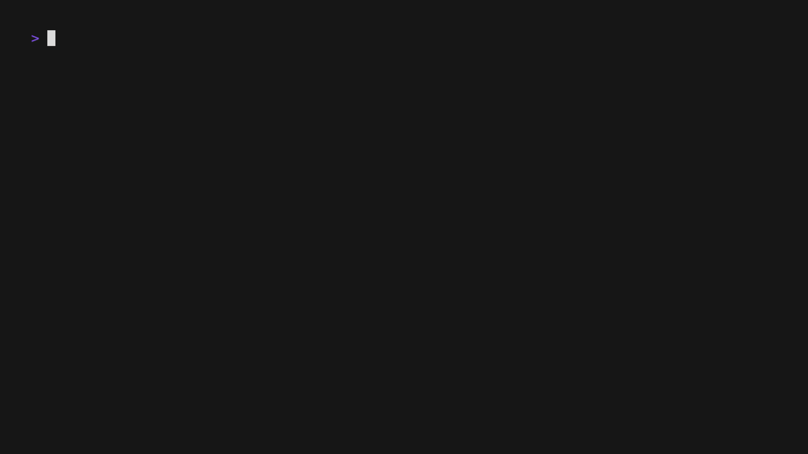

# Pequod

Pequod as in the boat, from Moby-Dick. Variable names are hard...

A tool for exploring Kubernetes clusters.

## Quick start

`go run ./cmd/main.go`

use ↑ and ↓ to choose a pod.
press enter on choosen pod to stream logs.
press tab to switch between pod and log view.

## Example


## TODO:
- [ ] allow for multiple Pages to be displayed at the same time.
- [x] log views for pods
- [x] log view needs to be a list so it can be scrolled.
- [ ] namespace filter for pods

## Debug

To debug use the `make debug` command to create a debug binary.  Run the debug binary (`./debug/pequod`).  Retrieve the PID of the debug pequod instance using `ps -a` then run a headless delve session `dlv attach  --listen=:2345 --headless --api-version=2 --log --continue --accept-multiclient <PID>`

Create a .vscode launch json that looks like this:

```
{
    // Use IntelliSense to learn about possible attributes.
    // Hover to view descriptions of existing attributes.
    // For more information, visit: https://go.microsoft.com/fwlink/?linkid=830387
    "version": "0.2.0",
    "configurations": [
        {
            "name": "Connect to server",
            "type": "go",
            "request": "attach",
            "mode": "remote",
            "remotePath": "${workspaceFolder}",
            "port": 2345,
            "host": "127.0.0.1"
        }
    ]
}
```
After that you can debug against the headless delve session as normal.  

**NOTE**: Experienced significant hangups when adding/removing break points and frequently had to restart the delve/pequod runtimes.